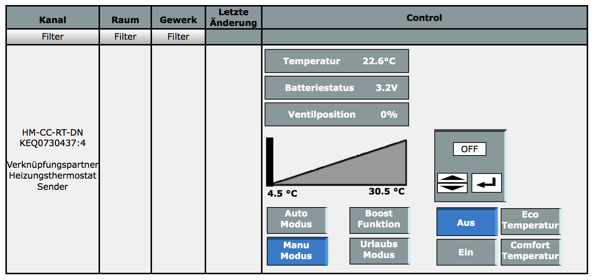

# HM-WebUI-CC-Mod
WebUI modification to display battery voltage and valve state

Login via ssh and execute the following commands: 
- `mount -o remount,rw /` 
- `wget -q -O - https://raw.githubusercontent.com/jp112sdl/HM-WebUI-CC-Mod/master/patch/heating_control.patch | patch /www/rega/esp/controls/heating_control.fn` 
- `wget -q -O - https://raw.githubusercontent.com/jp112sdl/HM-WebUI-CC-Mod/master/patch/webui_cc_add_batvalve.patch | patch /www/webui/webui.js` 
- `mount -o remount,ro /` 
- `/etc/init.d/S70ReGaHss restart` 
  
**At least clear your browser cache!**

